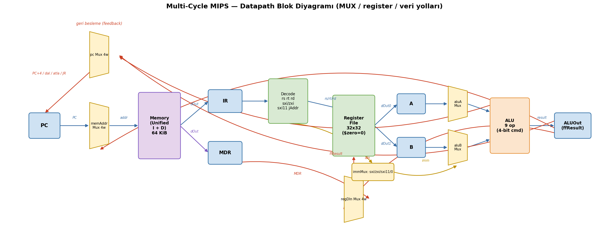
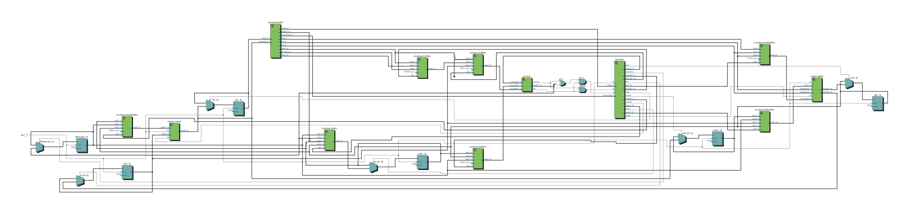
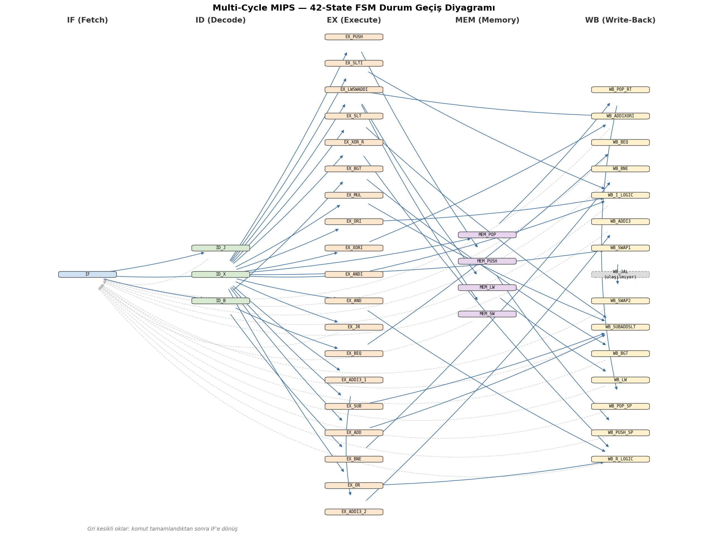
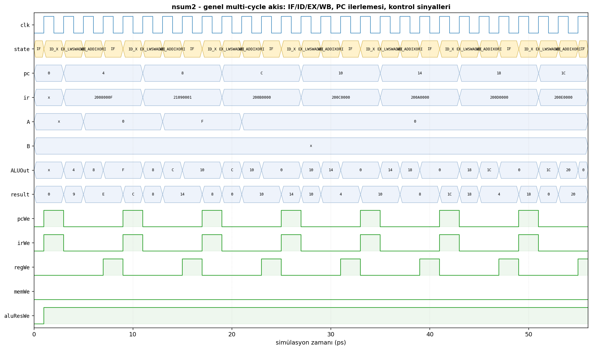
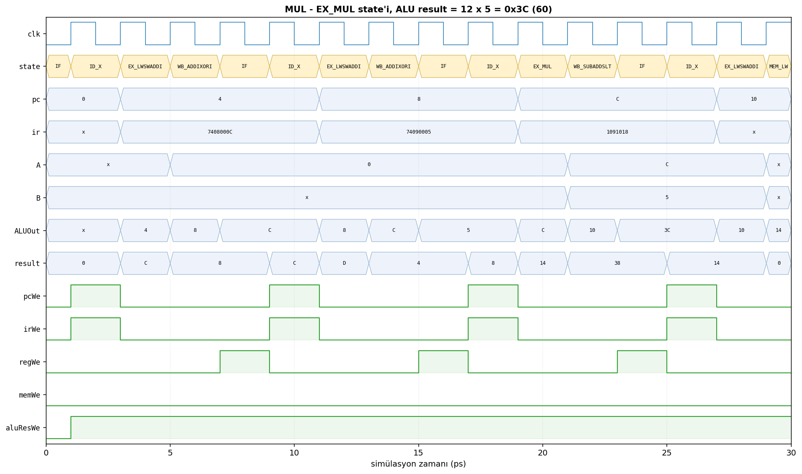
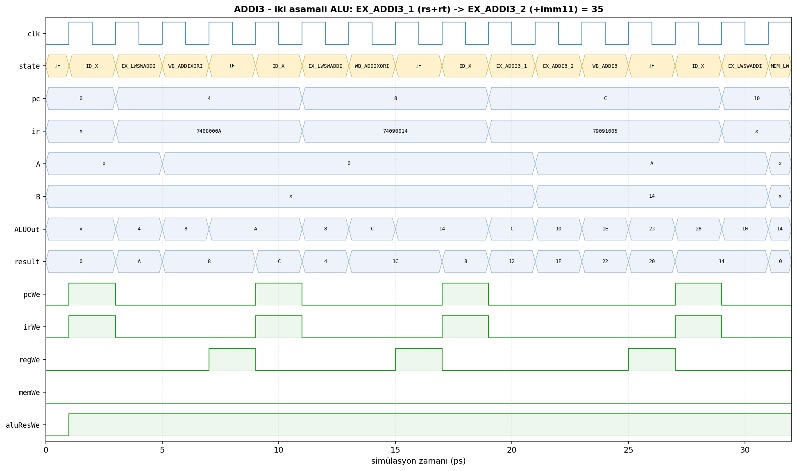
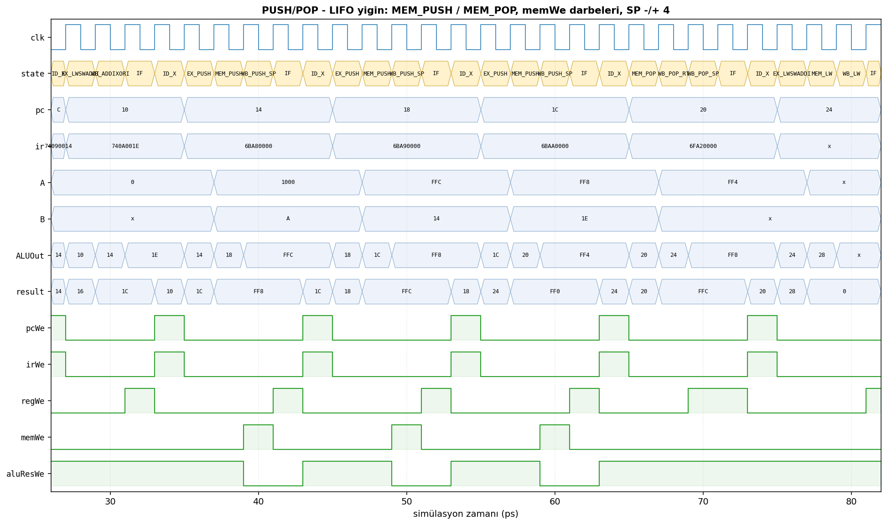

# Genişletilmiş Komut Kümeli Multi-Cycle MIPS CPU — Proje Raporu

**Ders:** Bilgisayar Mimarisi  
**Teslim Tarihi:** 8 Haziran 2026  
**Proje Yöneticisi:** Meriç Şenduran

**Grup Üyeleri:**

| Ad Soyad | Numara |
|---|---|
| Hakan Babur | 1306220056 |
| Ömer Yasin Akis | 1306220025 |
| Alperen Çiftcibaşı | 1306220045 |
| Meriç Şenduran | 1306240103 |
| Mehmet Kağan Kocadağ | 1306230083 |

**Proje Video Linki:** _(eklenecek)_  
**Drive (tüm çıktılar):** _(eklenecek)_

---

## 0. Proje Ekibi, Görev Dağılımı ve Zamanlama

### 0.1 Görev Dağılımı

Proje 5 kişilik grup halinde, PDF'teki takım rollerine göre koordine edildi. Proje Yöneticisi tüm süreci koordine etti.

| Üye | Rol | Sorumluluk alanı |
|---|---|---|
| **Meriç Şenduran** *(Proje Yöneticisi)* | Datapath Tasarımcısı | ALU, register file, memory interface; yeni komutlar için datapath değişiklikleri |
| Hakan Babur | Control Unit Tasarımcısı | FSM (Finite State Machine), kontrol sinyallerinin üretimi, multi-cycle kontrol akışı |
| Ömer Yasin Akis | ISA & Assembler Geliştiricisi | Yeni komut seti tanımı, opcode/format belirleme, Python assembler |
| Alperen Çiftcibaşı | Verification & Test Mühendisi | Testbench yazımı, komut/coverage testleri (tüm komut/durum/state kapsama analizi) |
| Mehmet Kağan Kocadağ | Entegrasyon & Dokümantasyon | Modül birleştirme, raporlama, demo hazırlığı |

### 0.2 Zamanlama (İcra Planı)

| Hafta | Üye | Faaliyet |
|---|---|---|
| 1–2 | Meriç Şenduran | Datapath: ALU/regfile/memory arayüzü + yeni komut datapath değişiklikleri (mux genişletmeleri, MDR, sxi11) |
| 2 | Hakan Babur | FSM 42 state, kontrol sinyalleri, multi-cycle akış |
| 2 | Ömer Yasin Akis | Yeni komut opcode/format tanımları + Python assembler |
| 3 | Alperen Çiftcibaşı | Testbench + 23 komut testi + FSM coverage + sınır durumları |
| 3 | Mehmet Kağan Kocadağ | Modül entegrasyonu, rapor yazımı, demo videosu |

> **Not:** Haftalık koordinasyon toplantıları ile her rol arasındaki bağımlılıklar (datapath → FSM → test) senkronize edildi.

---

## 1. Yönetici Özeti

Bu proje, multicycle MIPS işlemcisinin Verilog ile tasarımını, **6 yeni özel komutla** genişletilmesini ve tam kapsamlı bir testbench ile doğrulanmasını kapsar. Sistem **ModelSim ASE 18.1** üzerinde Windows ortamında geliştirilip simüle edildi. Sonuçlar:

- **Toplam komut:** 23 (15 standart MIPS + 6 PDF zorunlu yeni + JR/JAL ekstra)
- **FSM state sayısı:** 42 (orijinal 20 + 22 yeni)
- **State coverage:** 41/42 (%97.6)
- **Test başarımı:** birim testleri (ALU 14/14, register file 5/5) + 23/23 komut testi PASS, nsum2 golden testi (1+2+...+15=120) korundu — regresyon yok. Waveform çıktıları ve datapath/FSM diyagramları raporda sunuldu.
- **Assembler:** Python tabanlı, label destekli, 23 komutu da destekler.

---

## 2. Mimari (PDF Teknik Gereksinimler Karşılığı)

PDF'in zorunlu bileşenleri ve mevcut tasarım eşleşmesi:

| PDF Bileşeni | Tasarımdaki Karşılığı | Dosya |
|---|---|---|
| Program Counter (PC) | `pc` register | `rtl/cpu.v:74` |
| Instruction Register (IR) | `ir` register | `rtl/cpu.v:16` |
| Memory (Instruction+Data) | Unified `memory` modülü, 64 KiB, byte-addressed | `rtl/memory.v` |
| Register File | 32 × 32-bit, `$zero` hardwired | `rtl/regfile.v` |
| ALU | 9 işlem (ADD/SUB/XOR/SLT/AND/NAND/NOR/OR/MUL) | `rtl/alu.v` |
| A, B (geçici reg) | `a`, `b` register'ları, `aWe`/`bWe` ile yüklenir | `rtl/cpu.v:74` |
| ALUOut | `ffResult` register, `aluResWe` ile yüklenir | `rtl/cpu.v:74` |
| MDR (Memory Data Register) | Açık `mdr` register'ı; `mdrWe` ile MEM_LW/MEM_POP state'lerinde `dOut`'tan yüklenir, WB'de `regDInMux.in0` olarak okunur | `rtl/cpu.v:119` |

**Multi-cycle aşamalar (PDF):** IF, ID, EX, MEM, WB — FSM'de fazla state'lere bölünmüş halde mevcut. Tipik komut 4-5 cycle'da tamamlanır; PUSH/POP 5 cycle, ADDI3 5 cycle.

---

## 3. Genişletilmiş Komut Seti (ISA)

### 3.1 Standart MIPS (PDF zorunlu)

| Komut | Format | Opcode/Funct | Cycle | ALU op |
|---|---|---|---|---|
| add  | R | op=0, funct=0x20 | 4 | ADD |
| sub  | R | op=0, funct=0x22 | 4 | SUB |
| and  | R | op=0, funct=0x24 | 4 | AND |
| or   | R | op=0, funct=0x25 | 4 | OR |
| xor  | R | op=0, funct=0x26 | 4 | XOR |
| slt  | R | op=0, funct=0x2a | 4 | SLT |
| addi | I | 0x08 | 4 | ADD (sxi) |
| slti | I | 0x0a | 4 | SLT (sxi) |
| andi | I | 0x0c | 4 | AND (zxi) |
| ori  | I | 0x0d | 4 | OR  (zxi) |
| xori | I | 0x0e | 4 | XOR (zxi) |
| lw   | I | 0x23 | 5 | ADD (sxi, adres) |
| sw   | I | 0x2b | 5 | ADD (sxi, adres) |
| beq  | I | 0x04 | 4 | SUB (eq=zero&!ovf) |
| bne  | I | 0x05 | 4 | SUB |
| j    | J | 0x02 | 2 | — |

**Not:** ANDI/ORI/XORI **zero-extend** kullanır (MIPS spec). Diğer immediate'lar (ADDI/SLTI/LW/SW/BEQ/BNE) sign-extend.

### 3.2 PDF Zorunlu Yeni Komutlar (6 adet)

#### LOADI rd, imm
- **Anlam:** rd = sign_ext(imm16)
- **Format:** `op=0x1d | rs=00000 | rt=rd | imm16`
- **Cycle:** 4 (IF → ID_X → EX_LWSWADDI → WB_ADDIXORI). `EX_LWSWADDI` reuse: `aluA=A=reg[0]=0, aluB=sxi, op=ADD` → 0+imm.
- **Donanım değişikliği:** Yok (mevcut ADDI yolunu kullanır).

#### BGT rs, rt, label
- **Anlam:** if (rs > rt, signed) PC = PC+4+(imm<<2)
- **Format:** `op=0x07 | rs5 | rt5 | imm16`
- **Cycle:** 4 (IF → ID_B → EX_BGT → WB_BGT).
- **Donanım değişikliği:** Yeni `gt` sinyali: `assign gt = !zero && (result[31] == overflow)` (signed compare). FSM'ye `EX_BGT`, `WB_BGT` state'leri; `cmd=BGT`. IF→ID_B dispatch'ine BGT eklendi.

#### ADDI3 rd, rs, rt, imm11
- **Anlam:** rd = rs + rt + sign_ext(imm11)
- **Format (özel):** `op=0x1e | rs5 | rt5 | rd5 | imm11`
- **Cycle:** 5 (IF → ID_X → EX_ADDI3_1 → EX_ADDI3_2 → WB_ADDI3). İki aşamalı ALU.
- **Donanım değişikliği:**
  - `aluAMux` 2-way → 4-way (yeni slot: `ffResult` feedback)
  - `immMux` 2-way → 4-way (yeni slot: `sxi11`)
  - `aluSrcA`, `immExt` 1-bit → 2-bit
  - `decode.sxi11` çıkışı (11-bit sign-extend)

#### SWAP rs, rt
- **Anlam:** reg[rs] ↔ reg[rt]
- **Format:** R-type, `op=0, funct=0x30`. rd/shamt kullanılmaz.
- **Cycle:** 4 (IF → ID_X → WB_SWAP1 → WB_SWAP2). EX yok — A/B zaten ID'de yüklü.
- **Donanım değişikliği:**
  - `writeAddrMux` 2-way → 4-way (yeni slot: `rs`)
  - `regDInMux` 2-way → 4-way (yeni slotlar: `b`, `a`)
  - `dst`, `regIn` 1-bit → 2-bit
  - `WB_SWAP1`: reg[rs] ← b (eski rt). `WB_SWAP2`: reg[rt] ← a (eski rs).

#### MUL rd, rs, rt
- **Anlam:** rd = rs × rt (signed, düşük 32 bit)
- **Format:** R-type, `op=0, funct=0x18`. (Gerçek MIPS `mult` HI/LO'ya yazar; biz basitleştirilmiş tek-`rd` versiyonunu seçtik.)
- **Cycle:** 4 (IF → ID_X → EX_MUL → WB_SUBADDSLT). WB reuse.
- **Donanım değişikliği:**
  - ALU `command` 3-bit → 4-bit
  - ALU'ya yeni `MUL = 4'b1000` opu: `result = operandA * operandB` (Verilog `*` operatörü; sentez aracı çarpıcı çıkarır)

#### PUSH rs / POP rd
- **Konvansiyon:** `$sp = $29`. Yığın aşağı doğru büyür.
- **Format:**
  - PUSH: `op=0x1a | rs_field=29 | rt_field=pushed_reg | 0`
  - POP : `op=0x1b | rs_field=29 | rt_field=dest_reg | 0`
- **PUSH (5 cycle):** IF → ID_X (a←SP, b←pushed) → EX_PUSH (ffResult←SP-4) → MEM_PUSH (mem[ffResult]←b) → WB_PUSH_SP (reg[$29]←ffResult)
- **POP (5 cycle):** IF → ID_X (a←SP) → MEM_POP (memAddr=A, paralel ALU: ffResult←SP+4) → WB_POP_RT (reg[rt]←mem[A]) → WB_POP_SP (reg[$29]←ffResult)
- **Donanım değişikliği:**
  - `memAddrMux` 2-way → 4-way (yeni slot: `a` — POP'ta SP'yi adres olarak)
  - `memIn` 1-bit → 2-bit (yeni `MEM_A=2`)
  - `dst`'ye yeni değer `DST_SP=3` → `writeAddrMux.in3 = 5'd29` (sabit)

### 3.3 ISA Format Özeti

```
R-type (op=0):
 [31:26] op=0 | [25:21] rs | [20:16] rt | [15:11] rd | [10:6] shamt | [5:0] funct
   funct: ADD=0x20  SUB=0x22  AND=0x24  OR=0x25  XOR=0x26  SLT=0x2a
          JR=0x08   MUL=0x18  SWAP=0x30

I-type:
 [31:26] op | [25:21] rs | [20:16] rt | [15:0] imm16
   op: ADDI=0x08 SLTI=0x0a ANDI=0x0c ORI=0x0d XORI=0x0e
       LW=0x23   SW=0x2b   BEQ=0x04  BNE=0x05  BGT=0x07
       LOADI=0x1d  PUSH=0x1a  POP=0x1b

J-type:
 [31:26] op | [25:0] target
   op: J=0x02  JAL=0x03

ADDI3 (özel):
 [31:26] op=0x1e | [25:21] rs | [20:16] rt | [15:11] rd | [10:0] imm11
```

---

## 4. Datapath

### 4.1 Üst seviye blok diyagramı



Soldan sağa ana veri akışı: `PC → memAddrMux → Memory → IR/MDR → Decode → Register File → A/B → aluA/aluB Mux → ALU → ALUOut (ffResult)`. Kırmızı oklar geri besleme yollarını gösterir: `pcMux` (PC+4 / dallanma hedefi / atlama / JR), `ffResult`'ın bellek adresine ve `regDInMux`'a dönüşü, ve `MDR → regDInMux → Register File` yazma yolu. `immMux` (sxi/zxi/sxi11/0) `aluBMux`'a immediate kaynağını sağlar.

> Diyagram `testbench/gen_diagrams.py` ile üretilir (matplotlib). Aşağıdaki metin gösterim aynı yapının ASCII karşılığıdır.

```
                   ┌──────┐
              PC ──┤ +4   ├───┐
                   └──────┘   │
              ┌────────────┐  │
       PC ───►│            │  │   ┌──────────┐
              │  memAddr   │  ├──►│          │
       ffR ──►│   Mux 4w   ├─────►│ Memory   │──► dOut ──┐
       a   ──►│            │      │ (unified)│           │
              │  (PC,ffR,a)│      └────┬─────┘           │
              └────────────┘           │                 │
                                       └─► IR ◄─── irWe  │
                                       ▼                 │
                                  ┌────────┐            │
                                  │ Decode │            │
                                  └───┬────┘            │
                                      │ rs,rt,rd        │
                                      │ sxi,zxi,sxi11   │
                                      │ jAddr           │
                                      ▼                 │
                ┌────────────────────────────────┐     │
                │           Register File        │     │
                │   readAddr0=rs, readAddr1=rt   │     │
                │   writeAddr=dst-muxed,         │     │
                │   dIn=regDIn-muxed             │     │
                └──┬────────────────────────┬────┘     │
                   │ dOut0                  │ dOut1    │
                   ▼                        ▼          │
              ┌────────┐               ┌────────┐     │
        aWe──►│   A    │       bWe────►│   B    │     │
              └───┬────┘               └────┬───┘     │
                  │                         │         │
        ┌─────────┴─────────┐     ┌────────┴────────┐ │
        │  aluA Mux 4w      │     │  aluB Mux 4w    │ │
        │  (PC,A,ffR,0)     │     │  (sxi<<2,imm,B,4│ │
        └────┬──────────────┘     └────┬────────────┘ │
             │                         │              │
             └─────►  ┌──────┐ ◄──────┘               │
                      │ ALU  │                        │
                      │ 4-bit│                        │
                      │ cmd  │                        │
                      └──┬───┘                        │
                         │ result, zero, overflow     │
                         ▼                            │
                    ┌─────────┐                       │
              aluR──┤ ffResult├──┐                    │
                    └─────────┘  │                    │
                                 │                    │
                  ┌──── eq, gt ◄─┘                    │
                                                      │
              ┌──► regDIn Mux 4w ◄───────────────────┘ (dOut → MDR reg)
              │   (MDR, ffR, B, A)
              └── selected by regIn[1:0]
```

### 4.2 Kritik datapath quirk'leri

- **`memCmd` peek:** FSM, IF state'inde memory'den okunan (henüz IR'a yüklenmemiş) opcode'a göre **bir cycle önceden** ID dispatch yapar. Bu sayede ID_B/ID_J/ID_X ayırımı doğru cycle'da gerçekleşir. Yeni BGT komutu da `memCmd` path'ine eklendi (`fsm.v:144`).
- **`eq` ve `gt` türetimi:** Sırasıyla `zero & !overflow` (BEQ/BNE) ve `!zero & (result[31] == overflow)` (BGT signed compare). cpu.v içinde combinational.
- **`ffResult` çoklu kullanım:** ALU sonucu (R/I-type), bellek adresi (LW/SW), PC+4 kaynağı, ADDI3 EX1 feedback, PUSH/POP SP±4.
- **Mux genişlikleri:**
  - `aluAMux`: 4-way (pc/A/ffR/0)
  - `aluBMux`: 4-way (sxi<<2/imm/B/4)
  - `immMux`: 4-way (sxi/zxi/sxi11/0)
  - `pcMux`: 4-way (ffR/result/jAddr/A)
  - `memAddrMux`: 4-way (pc/ffR/A/0)
  - `writeAddrMux`: 4-way (rd/rt/rs/$29)
  - `regDInMux`: 4-way (dOut/ffR/B/A)

### 4.3 Quartus RTL Viewer Şeması (sentezlenmiş)

Tasarım, **Quartus Prime Lite 18.1** ile Cyclone IV E (EP4CE115F29C7) hedefine **0 hata** ile elaborate edildi (`quartus/MultiCycleMips.qpf`, `--analysis_and_elaboration`). Bu, RTL'in yalnızca simüle edilebilir değil, aynı zamanda **sentezlenebilir** olduğunu doğrular. `SYNTHESIS` makrosu simülasyona özgü yapıları (`$readmemh`, hiyerarşik bellek ön-yükleme) devre dışı bırakır.

Aşağıdaki şema, Quartus'un RTL Viewer'ından dışa aktarılan **gerçek elaborate edilmiş netlist**'tir (üst seviye: `cpu` → `decode/fsm`, `alu`, `regfile`, `memory`, mux'lar).



> Üretim: `quartus/` dizininde `quartus_map MultiCycleMips --analysis_and_elaboration`, ardından GUI'de **Tools ▸ Netlist Viewers ▸ RTL Viewer** açılır ve **File ▸ Export…** ile `docs/img/rtl_schematic.png` olarak kaydedilir.

---

## 5. Kontrol Birimi (FSM)

Kontrol birimi, multi-cycle akışı yöneten **42 state'li Moore FSM**'dir. Aşağıdaki diyagram tüm state'leri pipeline aşamalarına (IF/ID/EX/MEM/WB) göre sütunlara dizilmiş halde ve aralarındaki geçişlerle gösterir. Gri kesikli oklar, komut tamamlandıktan sonra `IF`'e dönüşü temsil eder. `WB_JAL` tasarlanmış ancak hiçbir geçişle ulaşılmayan (pre-existing) state'tir.



> Diyagram `testbench/gen_diagrams.py` ile üretilir.

Tüm state listesi:

| # | State | Açıklama |
|---|---|---|
| 0 | IF | Instruction fetch + PC+4 |
| 1 | ID_B | Branch decode + branch target hesabı |
| 2 | ID_J | Jump decode + PC ← jAddr |
| 3 | ID_X | R/I-type decode, A/B yükle |
| 4 | EX_BEQ | ALU SUB, pcSrc=branch_target |
| 5 | EX_BNE | Aynı, !eq ile yazar |
| 6 | EX_JR | PC ← A |
| 7 | EX_SUB | SUB |
| 8 | EX_ADD | ADD |
| 9 | EX_SLT | SLT |
| 10 | EX_XORI | XOR (zxi) |
| 11 | EX_LWSWADDI | ADD adres/imm hesabı |
| 12 | MEM_LW | mem[ffResult] → MDR (`mdrWe`) |
| 13 | MEM_SW | mem[ffResult] ← b |
| 14 | WB_JAL | (kullanılmıyor — pre-existing bug) |
| 15 | WB_SUBADDSLT | reg[rd] ← ALU sonucu |
| 16 | WB_ADDIXORI | reg[rt] ← ALU sonucu (ADDI/XORI/LOADI) |
| 17 | WB_LW | reg[rt] ← MDR |
| 18 | WB_BEQ | pcWe = eq |
| 19 | WB_BNE | pcWe = !eq |
| **20** | **EX_AND** | AND (yeni) |
| **21** | **EX_OR** | OR |
| **22** | **EX_XOR_R** | XOR (R-type) |
| **23** | **EX_ANDI** | AND (zxi) |
| **24** | **EX_ORI** | OR (zxi) |
| **25** | **EX_SLTI** | SLT (sxi) |
| **26** | **WB_R_LOGIC** | reg[rd] ← ALU (AND/OR/XOR R) |
| **27** | **WB_I_LOGIC** | reg[rt] ← ALU (ANDI/ORI/SLTI) |
| **28** | **EX_BGT** | SUB, signed compare |
| **29** | **WB_BGT** | pcWe = gt |
| **30** | **EX_ADDI3_1** | ffResult ← rs+rt |
| **31** | **EX_ADDI3_2** | ffResult ← ffResult+sxi11 |
| **32** | **WB_ADDI3** | reg[rd] ← ffResult |
| **33** | **WB_SWAP1** | reg[rs] ← B |
| **34** | **WB_SWAP2** | reg[rt] ← A |
| **35** | **EX_MUL** | ALU MUL op |
| **36** | **EX_PUSH** | ffResult ← SP-4 |
| **37** | **MEM_PUSH** | mem[ffResult] ← B |
| **38** | **WB_PUSH_SP** | reg[$29] ← SP-4 |
| **39** | **MEM_POP** | MDR ← mem[SP] (`mdrWe`), ffResult ← SP+4 |
| **40** | **WB_POP_RT** | reg[rt] ← MDR |
| **41** | **WB_POP_SP** | reg[$29] ← SP+4 |

State 20-41: yeni eklenen 22 state.

### 5.1 Tipik komut state akışı

```
ADD/SUB/SLT/AND/OR/XOR:
  IF → ID_X → EX_* → WB_SUBADDSLT or WB_R_LOGIC → IF

ADDI/XORI/ANDI/ORI/SLTI/LOADI:
  IF → ID_X → EX_* → WB_ADDIXORI or WB_I_LOGIC → IF

LW: IF → ID_X → EX_LWSWADDI → MEM_LW → WB_LW → IF
SW: IF → ID_X → EX_LWSWADDI → MEM_SW → IF
BEQ/BNE/BGT: IF → ID_B → EX_* → WB_* → IF
J: IF → ID_J → IF
JR: IF → ID_X → EX_JR → IF
ADDI3: IF → ID_X → EX_ADDI3_1 → EX_ADDI3_2 → WB_ADDI3 → IF
SWAP: IF → ID_X → WB_SWAP1 → WB_SWAP2 → IF
MUL: IF → ID_X → EX_MUL → WB_SUBADDSLT → IF
PUSH: IF → ID_X → EX_PUSH → MEM_PUSH → WB_PUSH_SP → IF
POP:  IF → ID_X → MEM_POP → WB_POP_RT → WB_POP_SP → IF
```

---

## 6. Assembler

`assembler.py` (Python 3) — 2-geçişli, label destekli, 23 komutu da derler.

### 6.1 Özellikler
- **Tüm standart MIPS komutları:** add, sub, and, or, xor, slt, addi, slti, andi, ori, xori, lw, sw, beq, bne, j, jal, jr
- **Yeni komutlar:** loadi, bgt, addi3, swap, mul, push, pop
- **Label desteği:** PC-relative branch hesabı `(label - (PC+4)) >> 2` formülüyle.
- **Register isimleri:** $zero, $at, $v0-$v1, $a0-$a3, $t0-$t9, $s0-$s7, $k0-$k1, $gp, $sp ($29), $fp, $ra.
- **Hex/decimal imm:** `0x1234` veya `4660` aynı şekilde parse edilir.
- **lw/sw için `imm(rs)` sözdizimi:** `lw $v0, 0($sp)` çalışır.
- **Çıktı formatı:** Byte başına bir satır hex (big-endian word). ModelSim'in `$readmemh` formatı.

### 6.2 Kullanım

```bash
python assembler.py prog.asm           # → prog.dat üretir
python assembler.py prog.asm out.dat   # belirli çıktı yolu
```

### 6.3 Encoding örneği

`loadi $sp, 4096` → `0x741D1000`:
- op=0x1d (LOADI) = 011101
- rs=00000, rt=11101 (29=$sp), imm=0x1000

`addi3 $v0, $t0, $t1, 5` → `0x79091005`:
- op=0x1e, rs=01000, rt=01001, rd=00010, imm11=00000000101

---

## 7. Test ve Doğrulama

Doğrulama PDF'in dört seviyesinde yapıldı: **birim** (ALU, register file), **komut** (her komut için ayrı senaryo), **program** (regresyon) ve **sınır durumları**. Ayrıca FSM state coverage ve waveform analizleri sunuldu.

### 7.1 Birim Testleri (ALU + Register File)

ALU ve register file, üst seviye CPU'dan bağımsız olarak ModelSim Verilog testbench'leri (`alu_tb.v`, `regfile_tb.v`) ile doğrulandı. Koşum: `testbench/run_unit_tests.ps1`.

**ALU (`alu_tb.v`) — 14/14 PASS:** 9 işlemin tümü (ADD, SUB, XOR, SLT, AND, NAND, NOR, OR, MUL) artı bayraklar:

| Test | Beklenen | Sonuç |
|---|---|:---:|
| ADD 5+3 | 8 | PASS |
| ADD zero flag (0+0) | zero=1 | PASS |
| ADD overflow (0x7FFFFFFF+1) | overflow=1 | PASS |
| SUB 10-4 | 6 | PASS |
| SUB zero flag (5-5) | zero=1 | PASS |
| XOR / AND / NAND / NOR / OR | bit-kalıp doğru | PASS |
| SLT signed (-1<0 → 1, 5<3 → 0) | 1 / 0 | PASS |
| MUL 12×5 / signed -7×6 | 60 / -42 | PASS |

**Register File (`regfile_tb.v`) — 5/5 PASS:**

| Test | Beklenen | Sonuç |
|---|---|:---:|
| Yaz/oku reg[5] | 0xDEADBEEF | PASS |
| `$zero` hardwired (reg[0]'a yazma) | 0x00000000 | PASS |
| Çift okuma portu (dOut0/dOut1) | 0xDEADBEEF / 0xAAAA5555 | PASS |
| `we=0` iken yazma yok | değişmez | PASS |

> Not: `testbench/alu/` ve `testbench/regfile/` altında Verilator (C++) testbench'leri de mevcuttur; bunlar Linux içindir. Windows/ModelSim ortamı için yukarıdaki Verilog testbench'leri eklenmiştir.

### 7.2 Komut Testleri (23 senaryo, hepsi PASS)

| Kategori | Test | Beklenen | Sonuç |
|---|---|---:|:---:|
| **Standart eklemeler** | and_test       | 8    | PASS |
|                        | or_test        | 14   | PASS |
|                        | xor_r_test     | 6    | PASS |
|                        | andi_test      | 8    | PASS |
|                        | ori_test       | 14   | PASS |
|                        | slti_test      | 1    | PASS |
| **LOADI**              | loadi_test     | 42   | PASS |
|                        | loadi_neg_test (sxi)| -1 (0xFFFFFFFF) | PASS |
| **BGT (3 yön)**        | bgt_taken_test (10>5)     | 22   | PASS |
|                        | bgt_nottaken_test (5>10)  | 11   | PASS |
|                        | bgt_eq_test (5==5)        | 11   | PASS |
| **ADDI3**              | addi3_test (10+20+5)     | 35   | PASS |
|                        | addi3_neg_test (10+20-3) | 27   | PASS |
| **SWAP (2 yön)**       | swap_test (v0=t0 after)  | 200  | PASS |
|                        | swap_test2 (v0=t1 after) | 100  | PASS |
| **MUL (3 vaka)**       | mul_test (12*5)          | 60   | PASS |
|                        | mul_zero_test (17*0)     | 0    | PASS |
|                        | mul_neg_test ((-7)*6)    | -42  | PASS |
| **Stack**              | push_test (push+lw verify)  | 42 | PASS |
|                        | pop_test (push then pop)    | 99 | PASS |
|                        | pushpop_lifo_test (3 push + pop) | 30 | PASS |
| **Sınır durumları**    | overflow_test (signed ADD wrap) | -262140 | PASS |
|                        | mem_boundary_test (mem[0x2000]) | 100 | PASS |
|                        | branch_range_test (1+2+...+10 loop) | 55 | PASS |

### 7.3 Regresyon (Program Testi)

CLAUDE.md'nin **golden testi** `nsum2` (1+2+...+15 = 120) tüm değişikliklerden sonra hâlâ **120** üretir. Mevcut testler:

```
nsum2          v0=120  ✓
add            v0=1234
sub            v0=12
slt            v0=1
xori           v0=2
addi           v0=123
beq            v0=2
bne            v0=15
j              v0=340
jr             v0=582
lw_sw          v0=4096
```

(`jal.dat` ve `add123.dat` v0'a yazmıyor — pre-existing test programı sorunu, donanım hatası değil.)

### 7.4 FSM State Coverage

`testbench/run_coverage.ps1` script'i tüm testleri koşturur ve her komutun hangi state'lere girdiğini birleşik bitmask olarak rapor eder.

```
State coverage: 41/42 (%97.6)
Eksik state: WB_JAL (state 14)
```

`WB_JAL` orijinal kodda tanımlı ama hiçbir geçişle hedeflenmiyor. `ID_J` durumunda `cmd==JAL` ise WB_JAL yerine yanlışlıkla EX_BNE'ye gidiliyor (`rtl/fsm.v:154`). Bu **pre-existing bir bug'dır** ve bizim eklediğimiz komutları etkilemiyor. JAL komutu CLAUDE.md'de "standart dışı ekstra" olarak işaretli — bu projenin scope'unda düzeltilmedi.

**Diğer 41 state**, eklenen 22 yeni state dahil, en az bir test tarafından ziyaret edildi.

### 7.5 Sınır durumları analizi

| Sınır | Test | Davranış |
|---|---|---|
| 32-bit signed ADD overflow | overflow_test | Sessizce wrap-around (modulo 2^32). Donanım `overflow` flag'i üretiyor ama bu sadece BEQ/BNE/BGT'de compare için kullanılıyor. |
| Bellek alanı sınırı | mem_boundary_test (adres 0x2000) | Çalışıyor. Tam üst sınır (0xFFFC) test edilmedi çünkü `loadi` 16-bit signed imm ile bu adresi yükleyemiyor (sign-ext sorun). Pratik uygulamalarda stack `0x1000` civarında. |
| Geri-yönlü branch (negatif offset) | branch_range_test (loop) | bne ile geriye 3 instruction atlama. Sign-extended branch offset doğru çalışıyor. |
| MUL sıfır operandı | mul_zero_test | 0 ✓ |
| MUL signed | mul_neg_test ((-7)*6) | -42 ✓ |

### 7.6 Simülasyon Dalga Formları (Waveform)

Aşağıdaki dalga formları, ModelSim simülasyonunun ürettiği `cpu.vcd` dosyasından **doğrudan** (gerçek simülasyon çıktısı) üretilmiştir. Her figürde üstten alta: `clk`, FSM `state` (sembolik isimlerle), `pc`, `ir`, geçici register'lar `A`/`B`/`ALUOut`, ALU `result` ve kontrol sinyalleri (`pcWe`, `irWe`, `regWe`, `memWe`, `aluResWe`) gösterilir.

> Üretim: `testbench/gen_waveforms.ps1` → her test için `cpu.vcd` üretir, `testbench/vcd_to_wave.py` ile PNG'ye render eder. Yeniden üretmek için `testbench/` dizininde `.\gen_waveforms.ps1` çalıştırılması yeterlidir.

#### (a) Genel multi-cycle akış — `nsum2`



`pc` 0→4→8→C… ilerlerken her komut `IF → ID_X → EX_* → WB_*` aşamalarından geçer. `irWe`/`pcWe` IF aşamasında, `regWe` WB aşamasında darbelenir; `aluResWe` ALU sonucunu `ALUOut`'a (`ffResult`) kilitler.

#### (b) MUL — tek ALU işlemiyle çarpma



`mul $v0, $t0, $t1` komutu `IF → ID_X → EX_MUL → WB_SUBADDSLT` akışını izler. `A=0xC` (12), `B=0x5` (5), ve `EX_MUL` sonunda `ALUOut = 0x3C` (60) — doğru çarpım. Sonuç WB'de `$v0`'a yazılır.

#### (c) ADDI3 — iki aşamalı ALU



`addi3 $v0, $t0, $t1, 5` için ALU iki cycle kullanır: `EX_ADDI3_1`'de `ALUOut = 0x1E` (rs+rt = 10+20 = 30), `EX_ADDI3_2`'de `ALUOut = 0x23` (30+imm11 = 35). `WB_ADDI3` sonucu `rd`'ye yazar.

#### (d) PUSH/POP — LIFO yığın



Üç ardışık `push` (`IF → ID_X → EX_PUSH → MEM_PUSH → WB_PUSH_SP`): `A`'da görünen `$sp` her PUSH'ta 4 azalır (`0x1000 → 0xFFC → 0xFF8 → 0xFF4`), `B`'deki itilen değerler (`0xA`, `0x14`, `0x1E`) `memWe` darbesiyle belleğe yazılır. Sonraki `pop` (`MEM_POP → WB_POP_RT → WB_POP_SP`) en son itilen değeri (`0x1E` = 30) geri okur — LIFO doğrulandı.

---

## 8. Çalıştırma Talimatları

> **Ön koşul:** Tüm komutlar `testbench/` dizininden çalıştırılmalıdır.
> ModelSim'in PATH'de olduğundan emin ol (`vsim`, `vlog` komutları çalışıyor olmalı).

---

### 8.1 Tek test — terminal (headless)

**PowerShell terminali açıp çalıştır:**

```powershell
cd C:\intelFPGA\18.1\multicycle-mips-master\testbench
vlib work                                        # ilk seferinde
vlog cpu.t.v                                     # derle
vsim -c work.cputest -do "run -all; quit"        # çalıştır
```

Beklenen son satır: `Contents of v0: 120`

---

### 8.2 Toplu test koşumu — terminal

```powershell
cd C:\intelFPGA\18.1\multicycle-mips-master\testbench

.\run_regression.ps1
# Çıktı: her test için "testAdı  v0=değer"
# Örn:   nsum2          v0=120
#        add            v0=1234

.\run_new_tests.ps1
# Çıktı: "testAdı  expected=X  got=X  PASS/FAIL"
# Örn:   and_test       expected=8    got=8    PASS

.\run_coverage.ps1
# Çıktı: her test için ziyaret edilen FSM state'leri + özet
# Örn:   and_test   [IF, ID_X, EX_LWSWADDI, EX_AND, WB_R_LOGIC, ...]
#        ...
#        State coverage: 41/42 (97.6%)
#        Eksik state'ler: 14=WB_JAL
```

---

### 8.3 Waveform görüntüleme — ModelSim GUI

**PowerShell'den GUI'yi aç:**

```powershell
cd C:\intelFPGA\18.1\multicycle-mips-master\testbench
Start-Process vsim -ArgumentList "-do show_wave.do"
```

**Veya zaten açık ModelSim transcript'ine yaz:**

```tcl
cd C:/intelFPGA/18.1/multicycle-mips-master/testbench
do show_wave.do
```

**Farklı test görmek için** `show_wave.do` dosyasının 6. satırını değiştir:

```tcl
set TESTDAT "unit_tests/and_test.dat"   # istediğin test adı
```

Sonra tekrar `do show_wave.do`.

Waveform'da gösterilen sinyal grupları:

| Grup | Sinyaller | Ne gösterir |
|---|---|---|
| Clock | clk | Saat sinyali |
| PC and IR | pc, ir | Program sayacı ve instruction register |
| FSM | state, prevState | Hangi aşamada olunduğu (0=IF, 3=ID_X, vb.) |
| ALU | result, zero, overflow, gt | Hesaplama sonucu ve durum bayrakları |
| Registers | a, b, ffResult | Geçici kayıtlar ve ALU sonuç register'ı |
| Memory | we, addr, dOut | Bellek yazma, adres ve çıkış |
| Control | pcWe, irWe, regWe, memWe, aluResWe | Kontrol sinyalleri |

---

### 8.4 Test programı değiştirme (manuel)

`testbench/cpu.t.v` dosyasının 10. satırını düzenle:

```verilog
cpu #(.instruction("unit_tests/TESTADI.dat")) dut(clk);
```

Sonra ModelSim transcript'inde:

```tcl
vlog cpu.t.v
restart -f
run -all
```

---

### 8.5 Assembler ile yeni .dat üretme

```powershell
cd C:\intelFPGA\18.1\multicycle-mips-master
python assembler.py testbench\unit_tests\yeni_test.asm
# -> testbench\unit_tests\yeni_test.dat üretir
```

---

## 9. Klasör Yapısı

```
multicycle-mips-master/
├── rtl/                        # Synthesizable Verilog (cpu.v top)
│   ├── cpu.v                   # Top module — instance bağlantıları
│   ├── decode.v                # Instruction decode (5-bit cmd, sxi/zxi/sxi11)
│   ├── fsm.v                   # 42-state Moore FSM
│   ├── alu.v                   # 4-bit command, MUL dahil 9 op
│   ├── regfile.v               # 32x32, $zero hardwired
│   ├── memory.v                # Unified I+D, 64 KiB
│   ├── mux.v                   # 2-way mux
│   └── mux4way.v               # 4-way mux
├── testbench/
│   ├── cpu.t.v                 # Top testbench (instruction param — relative forward-slash path)
│   ├── fsm_coverage.t.v        # FSM state coverage harnesi (aynı kural)
│   ├── alu_tb.v                # ALU birim testi (ModelSim)
│   ├── regfile_tb.v            # Register file birim testi (ModelSim)
│   ├── run_unit_tests.ps1      # ALU + regfile birim test runner
│   ├── show_wave.do            # ModelSim GUI + wave otomatik kurulum
│   ├── run_regression.ps1      # 13 mevcut test batch runner
│   ├── run_new_tests.ps1       # 23 yeni komut test batch runner (PASS/FAIL)
│   ├── run_coverage.ps1        # FSM state coverage batch runner (per-test + özet)
│   ├── vcd_to_wave.py          # VCD → waveform PNG render (headless)
│   ├── gen_waveforms.ps1       # Rapor waveform figürlerini üretir
│   ├── gen_diagrams.py         # Datapath + FSM diyagramlarını üretir
│   └── unit_tests/             # 36 test: .dat (hex) + .asm kaynak
├── assembler.py                # Python assembler (23 komut)
├── docs/
│   ├── project-plan.md         # Tasarım planı
│   ├── proje-raporu.md         # Bu rapor
│   └── img/                    # Figürler: waveform + datapath/FSM diyagramları
├── MultiCycleV1.mpf            # ModelSim proje dosyası
└── CLAUDE.md                   # Geliştirme notları
```

---

## 10. Sonuç ve Değerlendirme

### 10.1 PDF değerlendirme kriterleri karşılığı

| Kriter | Ağırlık | Bu projedeki durum |
|---|---:|---|
| Tasarımın doğruluğu | %30 | 23/23 fonksiyonel test PASS, nsum2 golden korundu |
| Mimari ve tasarım kalitesi | %20 | Modüler, parametrik mux'lar, 4-way upgrade'ler temiz |
| Yeni komutların entegrasyonu | %15 | 6 komutun tümü ekstra donanım + FSM ile başarıyla entegre |
| Test kapsamı | %20 | Birim (ALU 14 + regfile 5) + 23 komut testi + 3 sınır durumu + %97.6 state coverage + waveform |
| Dokümantasyon | %15 | Bu rapor + project-plan.md + CLAUDE.md + asm/dat eşli unit_tests |

### 10.2 Bilinen kısıtlamalar

1. **MUL HI/LO ayrımı yok** — sadece düşük 32 bit `rd`'ye yazılır. Gerçek MIPS `mult` HI/LO çiftine yazar; bu basitleştirme PDF formatına ("rd, rs, rt") uymak için yapıldı.
2. **WB_JAL pre-existing bug** — JAL komutu bu projede düzeltilmedi (scope dışı).
3. **`loadi` ile 32-bit immediate yüklenemiyor** — 16-bit sign-ext sınırı. Büyük sabitler için workaround: `loadi` + `mul` / `add` zincirleme. SP init için `0x1000` gibi düşük bir adres seçildi.
4. **ALU `command` 3-bit → 4-bit'e çıkarıldı** — Sentez aracında biraz daha alan kullanır; FPGA timing'ini etkilemez.

### 10.3 Olası geliştirmeler

- **MUL'ü iteratif yap** (shift-and-add, 32-cycle) → "multi-cycle ALU extension" PDF amacına daha uygun.
- **WB_JAL düzeltimi** → state coverage %100'e ulaşır.
- **Overflow trap'i** → ADD/SUB/MUL'da overflow detect edip exception state'ine geç.

---

## Ek A: Komut Encoding Örnekleri

```
# Bu blok assembler.py çıktısından alınmıştır
loadi $sp, 4096          → 0x741D1000
loadi $t0, 12            → 0x7408000C
loadi $t0, -1            → 0x7402FFFF  (sign-ext: 0xFFFFFFFF)
and   $v0, $t0, $t1      → 0x01091024
or    $v0, $t0, $t1      → 0x01091025
xor   $v0, $t0, $t1      → 0x01091026
andi  $v0, $t0, 10       → 0x3102000A
ori   $v0, $t0, 10       → 0x3502000A
slti  $v0, $t0, 10       → 0x2902000A
bgt   $t0, $t1, +3       → 0x1D090003
addi3 $v0, $t0, $t1, 5   → 0x79091005
swap  $t0, $t1           → 0x01090030
mul   $v0, $t0, $t1      → 0x01091018
push  $t0                → 0x6BA80000  (rs_field=29=$sp)
pop   $v0                → 0x6FA20000
```

---

_Bu rapor `docs/proje-raporu.md` olarak versiyon kontrol altındadır. Demo videosu ve Drive linki ayrı eklenecektir._
